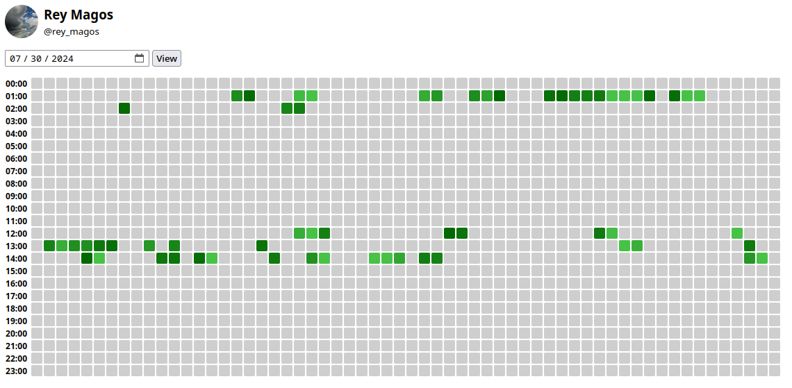

Display how much time your contacts are online in telegram as activity graph



# Usage

## Prerequirements

You need installed `mongodb`

## Installation

Clone repository:
```bash
git clone https://github.com/krozzzis/onlinespy
cd onlinespy
```

Install dependencies:
```bash
poetry install
```

Create file `settings.py` with content:
```python
# Get at https://core.telegram.org/api/obtaining_api_id
api_id = ... 
api_hash = "..."
```

Run bot:
```bash
poetry run python bot.py
```

Run webserver:
```bash
poetry run fastapi dev api.py
```

Open [http://127.0.0.1:8000/static/index.html](http://127.0.0.1:8000/static/index.html)
